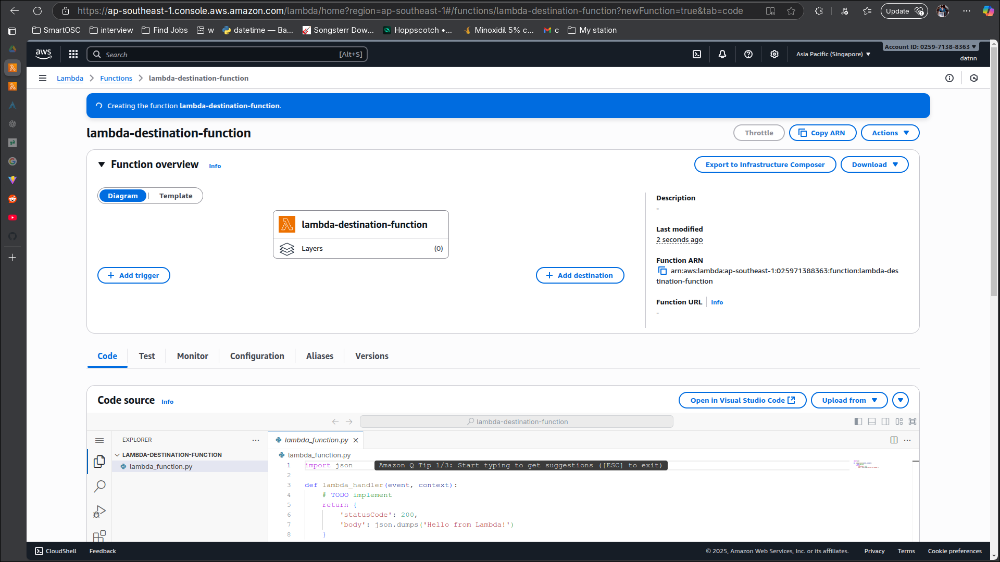
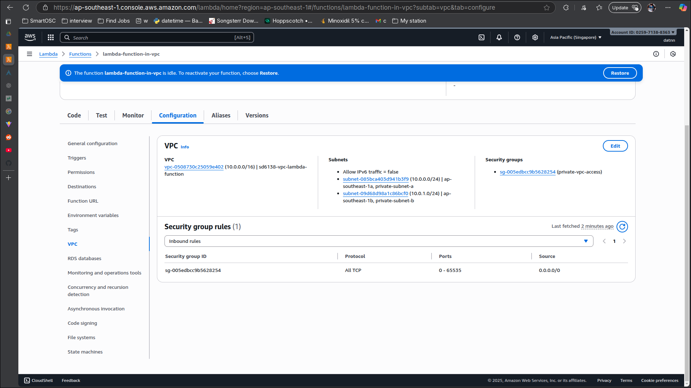
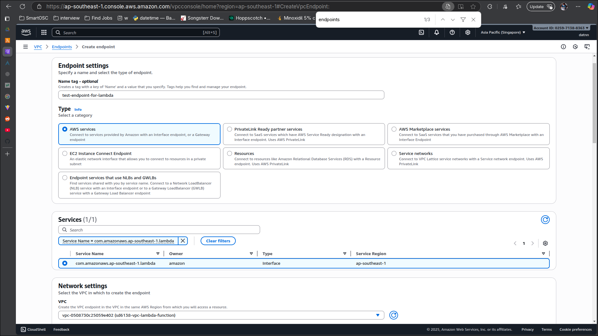
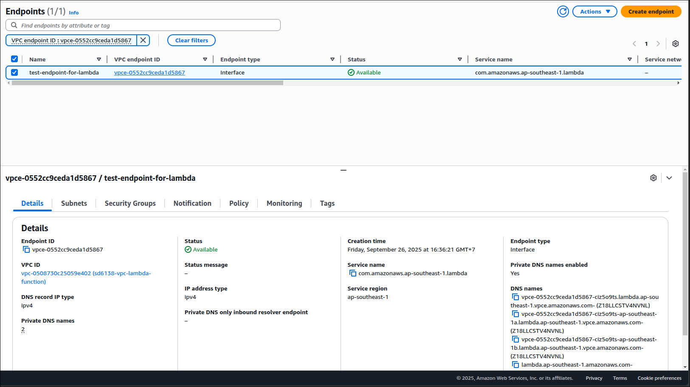
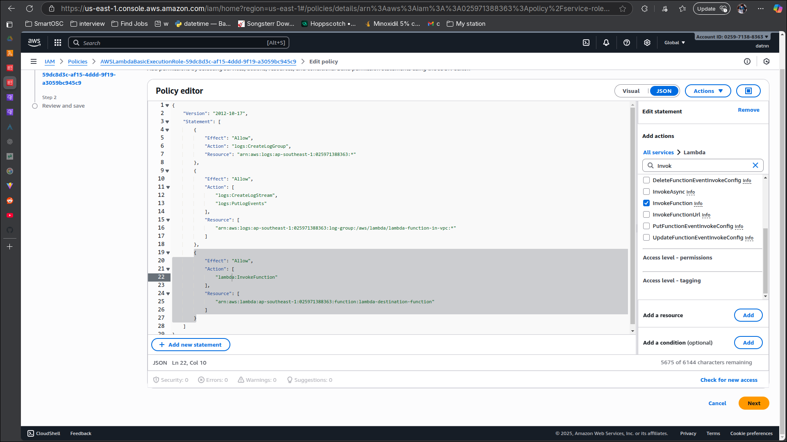
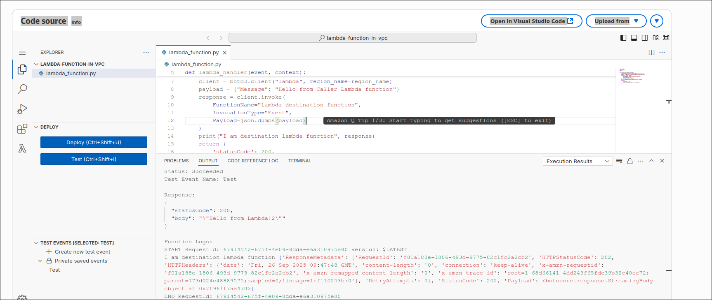
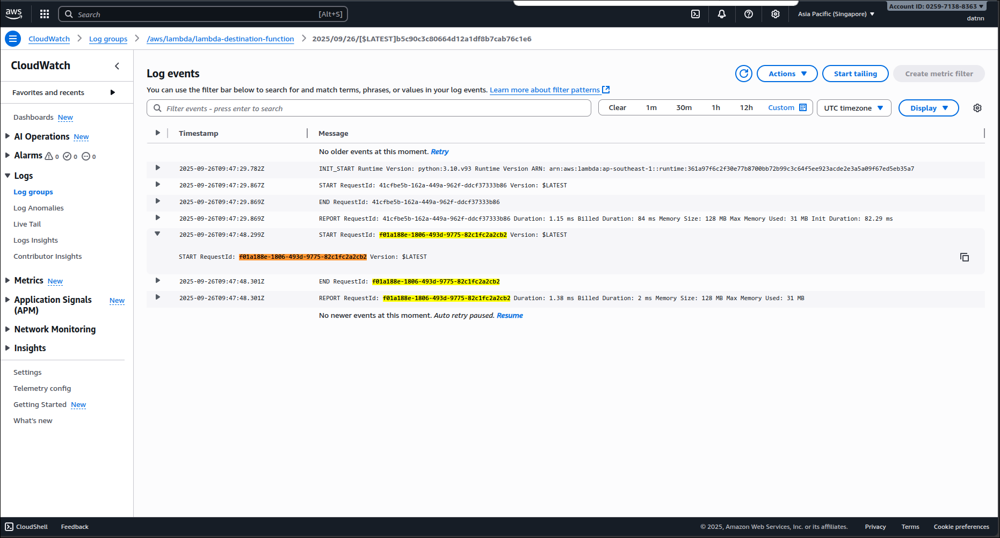

# Invoke Lambda in VPC

## Create VPC
- Create vpc for lambda with private subnet by availability zone

## Create the lambda function to invoke another lambda function

Selecting VPC

Created caller lambda function

## Create lambda destination function

## Create a vpc endpoint for lambda function

# Retest invoke function
- Adding permission to invoke lambda function from vpc endpoint

- Invoke lambda function from vpc

- Found request with ID `f01a188e-1806-493d-9775-82c1fc2a2cb2` from Cloudwatch Log of destination function

