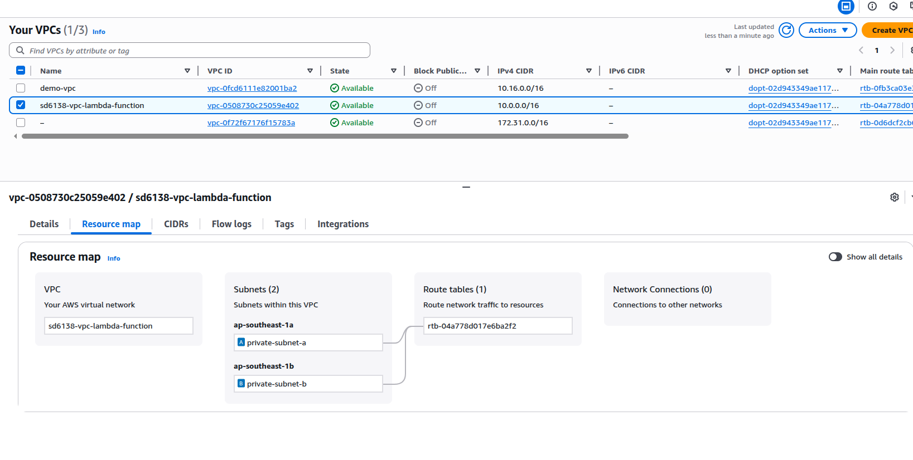
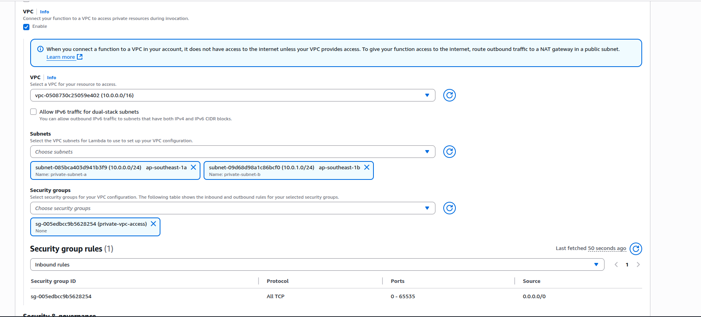
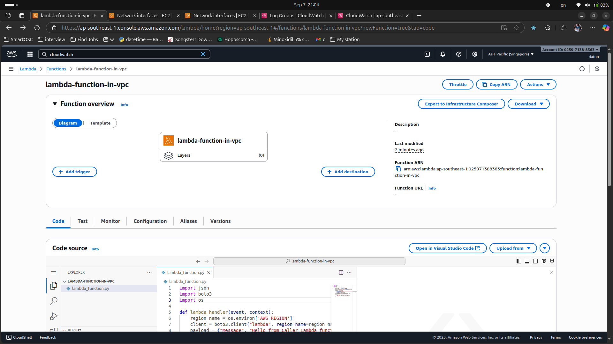
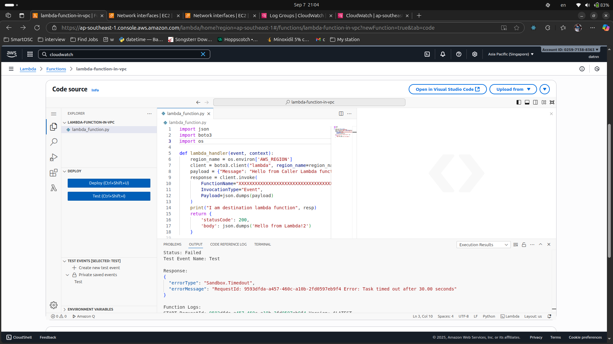

# Invoke Lambda in VPC

## Create VPC
- Create vpc for lambda with private subnet by availability zone

## Create the lambda function to invoke another lambda function

Selecting VPC

Created caller lambda function

## Create lambda destination function
