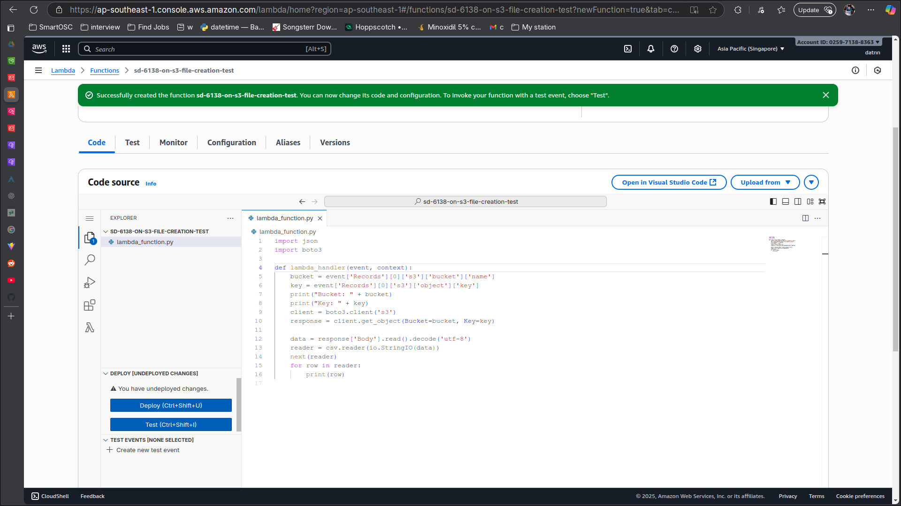

# AWS Lambda Trigger S3 Upload

## Create S3 bucket

## Create lambda function for parsing file from s3

## Create trigger for lambda function

## Upload csv file to s3

- Test csv file

- Upload csv file to s3

- Cloudwatch log from lambda function
