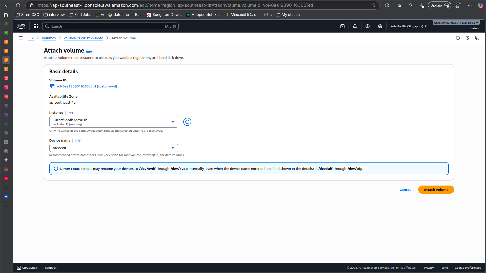
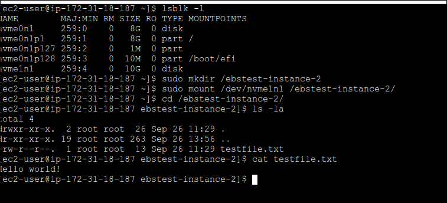

# AWS EC2 EBS

## Create EC2 instance at ap-southest-1a

## Create EC2 instance at ap-southest-1b

## Create an EBS volume

## Attach volume to instance running at ap-southeast-1a

## Checking volume existed on instance

- Creating file system xfs on volume

- Mounting folder from instance to volume

- Updating Fstab to auto mount on boot

- Creating test file to folder `/ebstest`

## Create ebs snapshot for instance 1 at '/dev/sdf'

- Create volume from snapshot with availability zone `ap-southeast-1b`

- Attach volume to instance running at ap-southeast-1b

- Access instance at ap-southeast-1b and check the file exist

