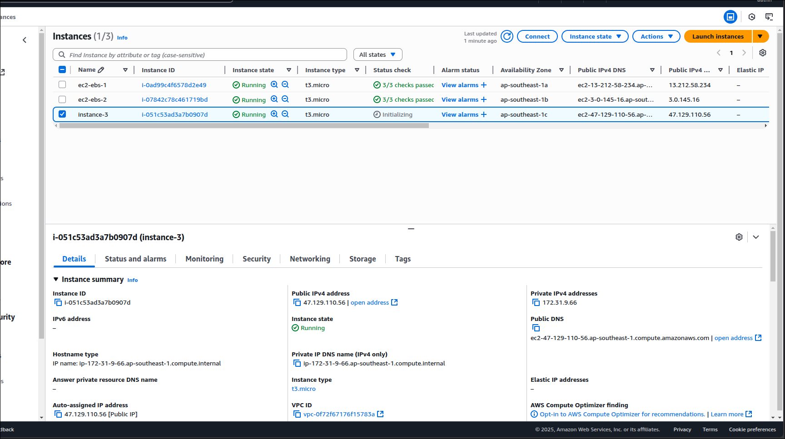
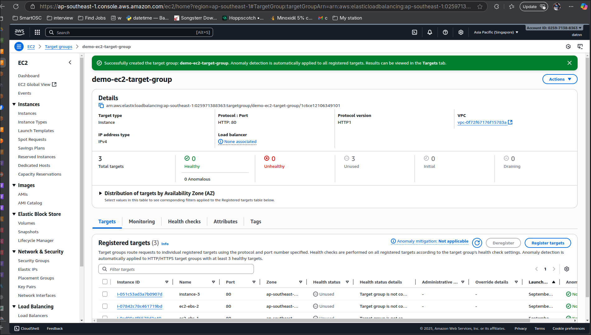
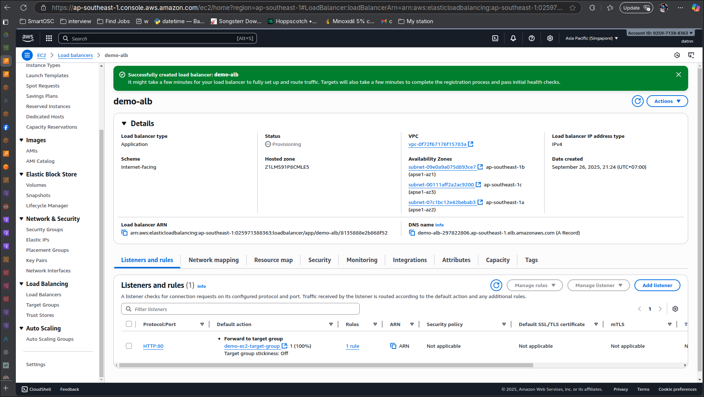
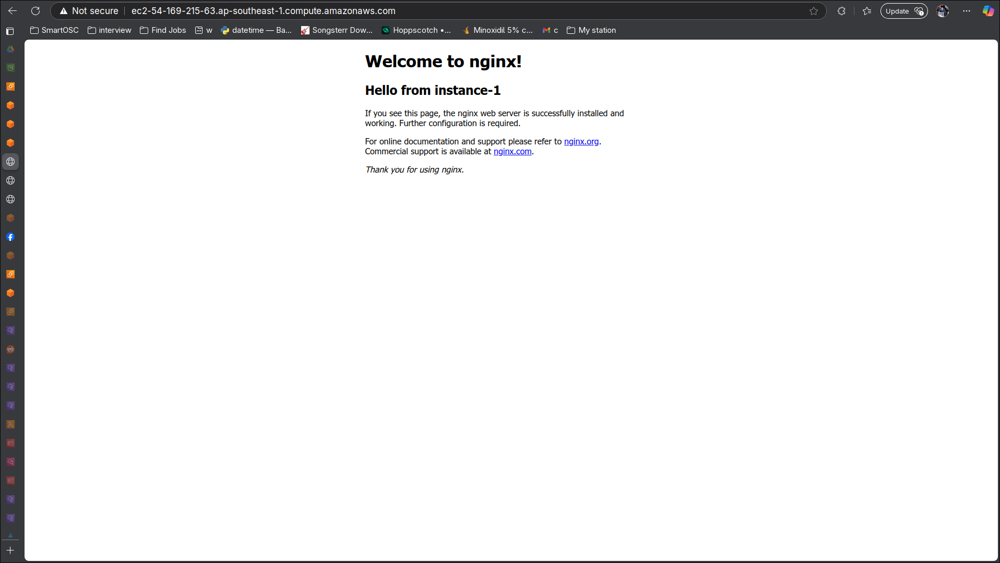
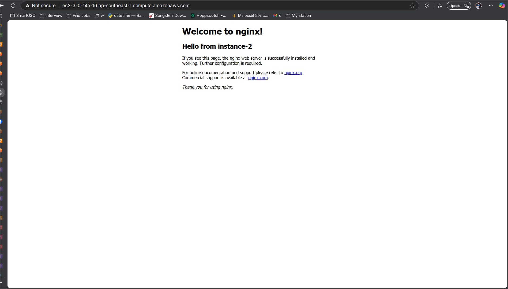
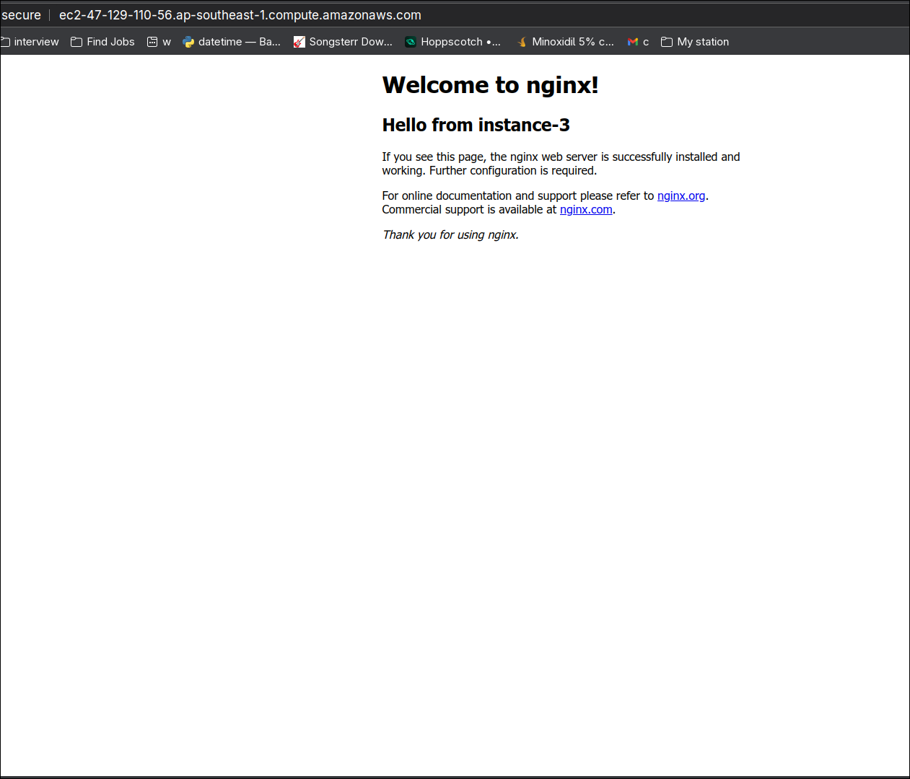
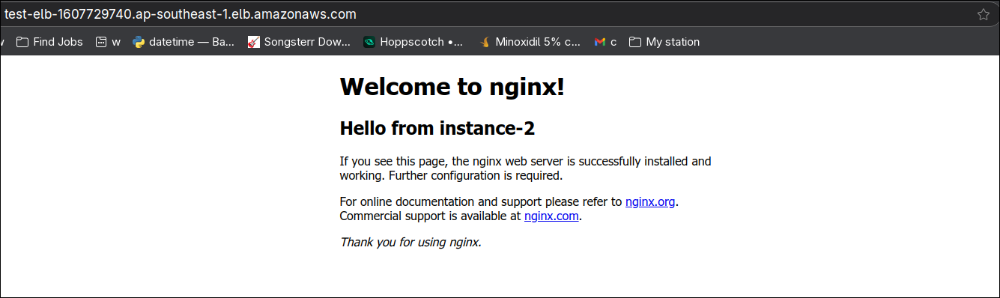
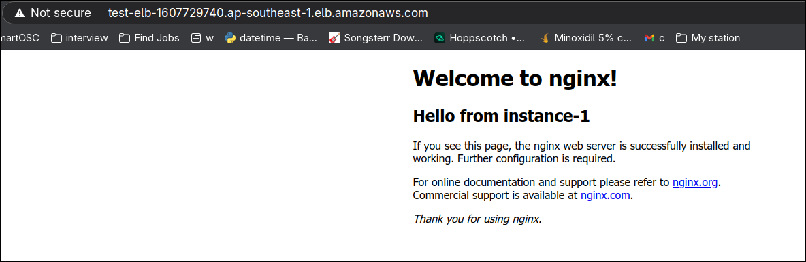
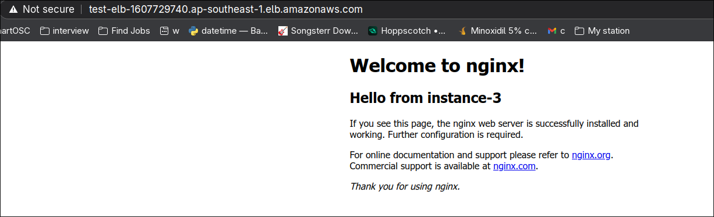

# AWS ELB

- Continue from Session2/AWS-Elastic-Load-Balancers/README.md

## Create additional instance number 3 at `ap-southeast-1c`

## Create a target group that include all 3 instances

## Create Load balancer to this target group

## Have nginx serve html over 3 instances

## Test elb online

First time pointed to instance-2

Second time pointed to instance-1

Third and forth point to instance-3

