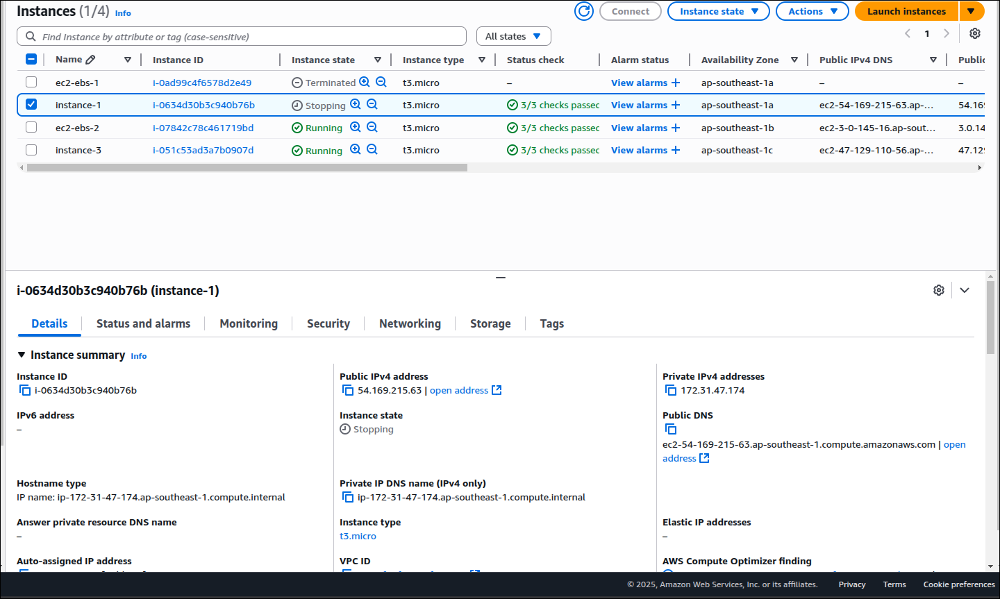

# AWS Route 53 Healthcheck Failover Routing

## Create ec2 instance with hosted html number 1

## Create ec2 instance with hosted html number 2

## create healthcheck for ec2 instance host

## Create Route53 record for both ec2 and s3, with failover to healthcheck

## Test with curl from instance-2

- See the html return is from instance number 1

- Kill instance 1

- Service become unhealthy

- Retest with curl

