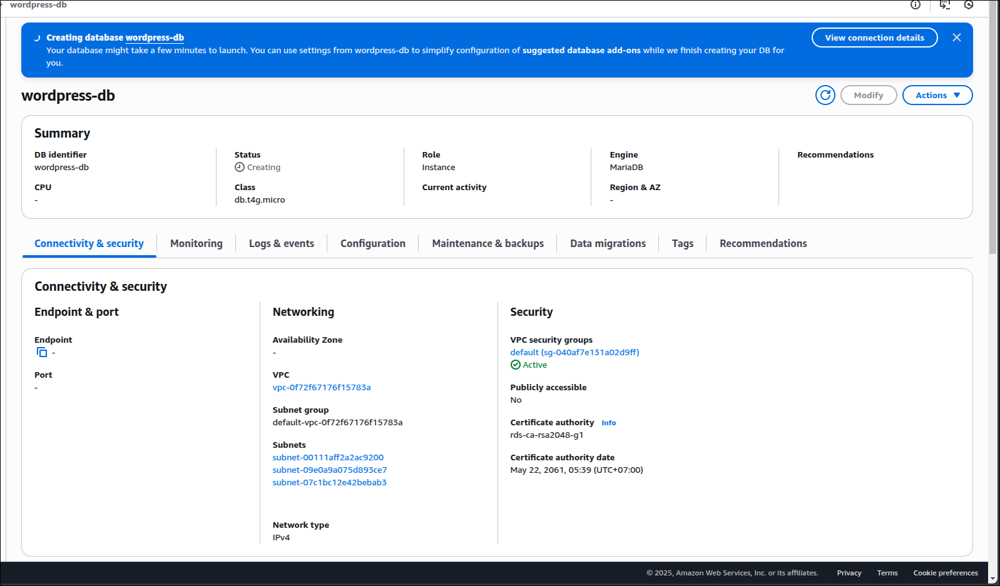
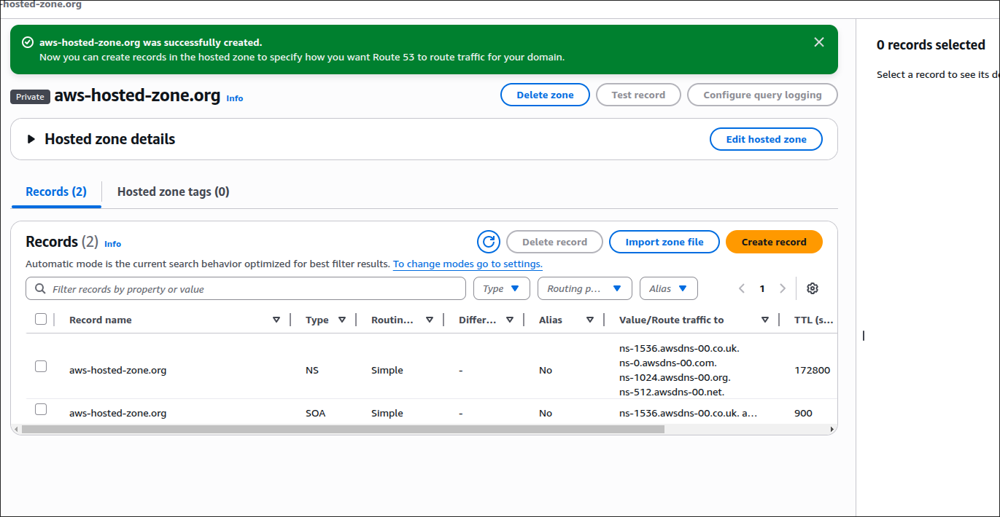
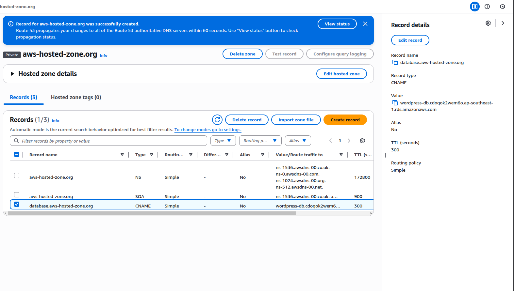
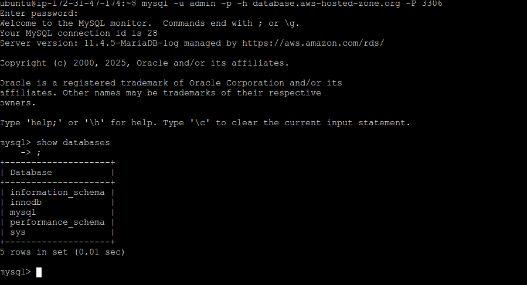

# AWS Route53 Private hosted zone

## Create RDS database

## Create Route53 private hosted zone

## Create CName record for RDS database

## Going into EC2 instance and try to connect to RDS database

