# AWS VPC,IGW,Public subnet exercise

## Create VPC with name `demo-vpc` and CIDR `10.16.0.0/16`

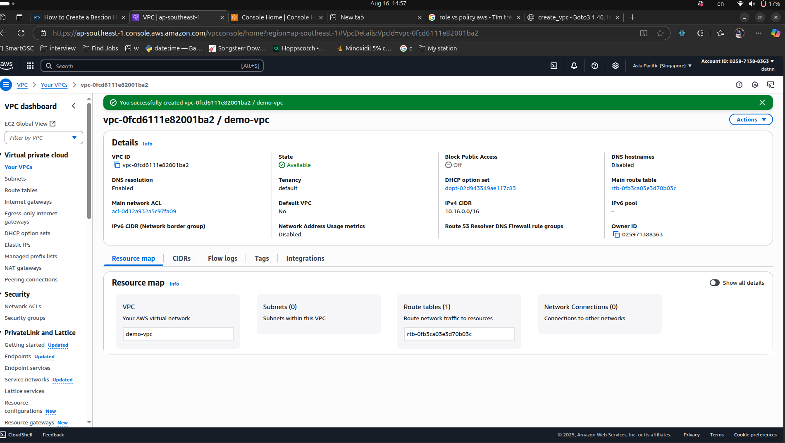

## Create Subnet

Creating 2 public subnet with CIDR block `10.16.0.0/20` and `10.16.16.0/20`

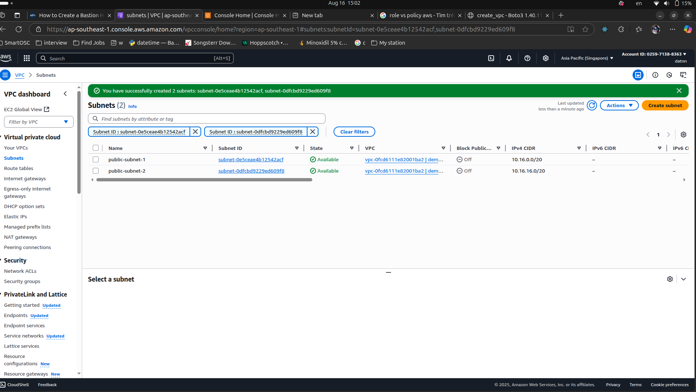

## Create Internet Gateway

Creating IGW and attach it to `demo-vpc`

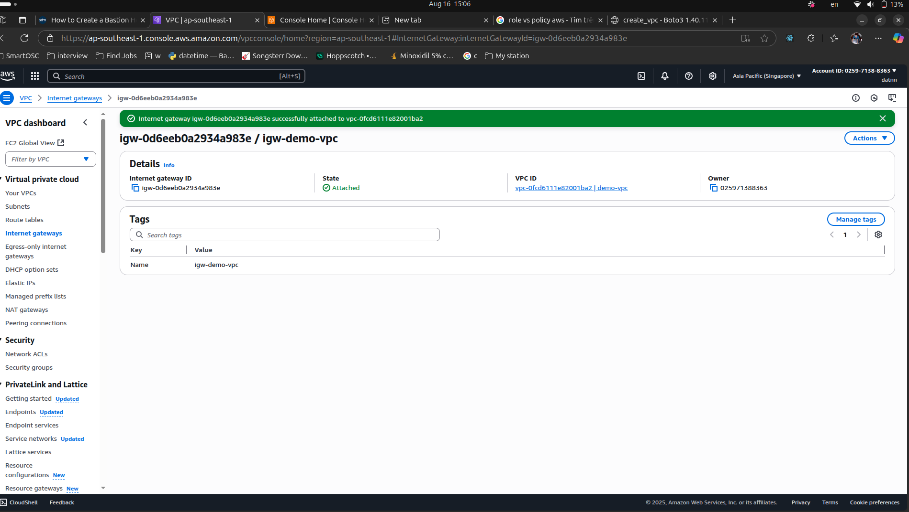

## Create Route Table

- Create route table for `demo-vpc` named `rt-web-demo-vpc`

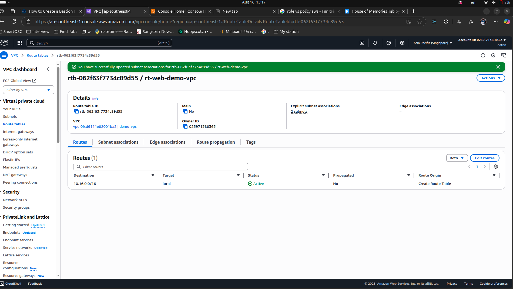

- Associate subnet to rt

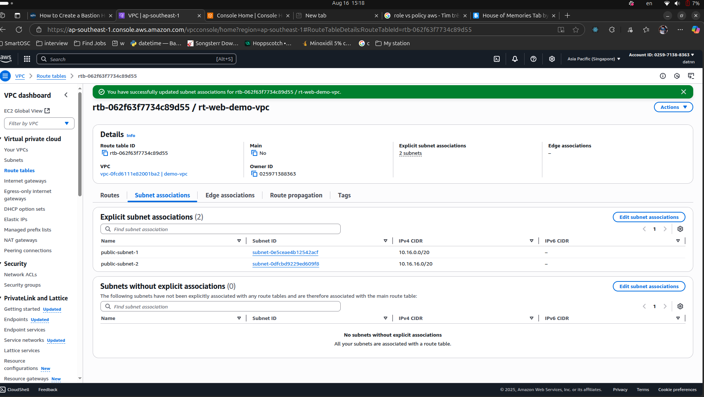

- Add new route for IPv4 (0.0.0.0/0 to `igw-demo-vpc`)

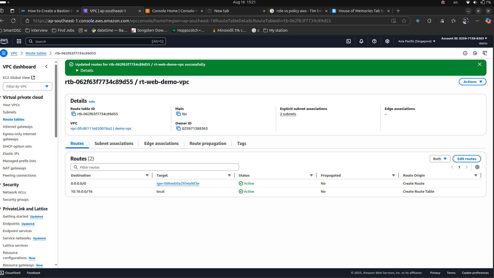

## Create EC2

- Create EC2 instance for testing public subnet

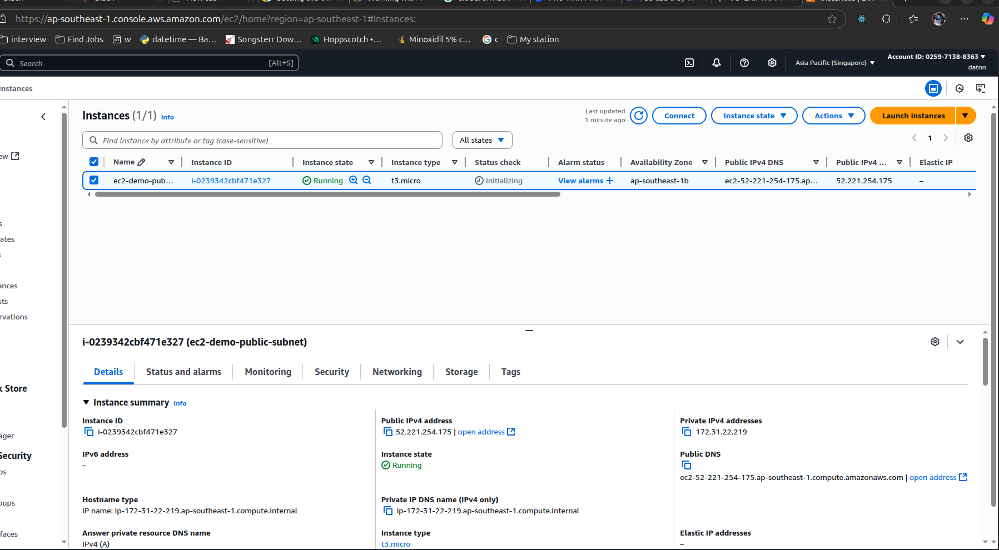

- Try to connect to EC2 instance with SSH

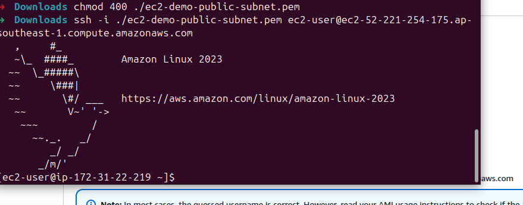

- Try to ping `google.com` from EC2 instance successfully

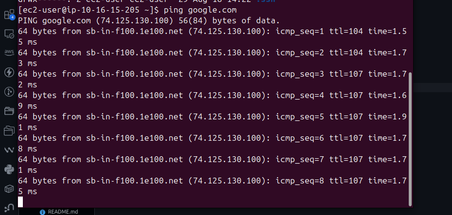

## Test scenario: Remove public subnet and retry to connect to EC2

- Subnet detached 

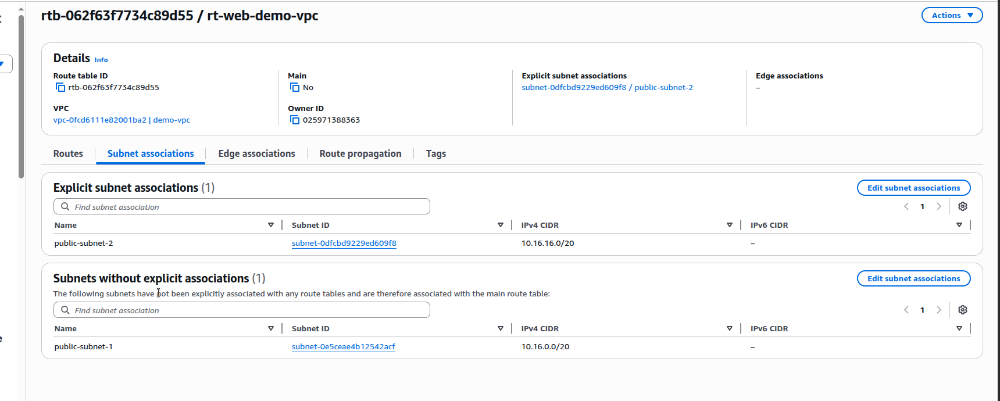

- Unable to connect to EC2 instance

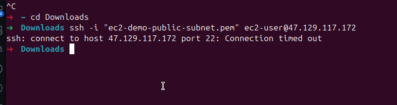

## Test scenario: Delete outbound rule
**Expected: Unable to access internet from inside EC2 instance**

- Delete outbound rule
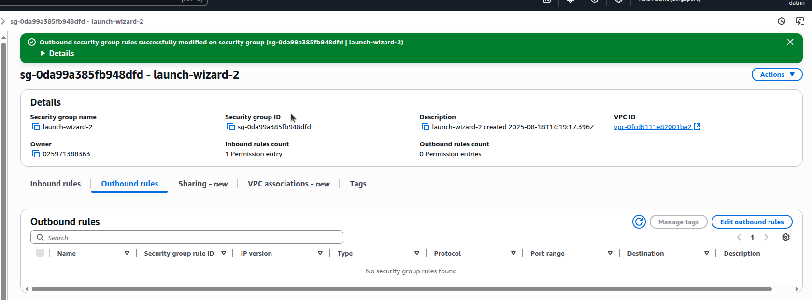

- Try to ping `google.com`
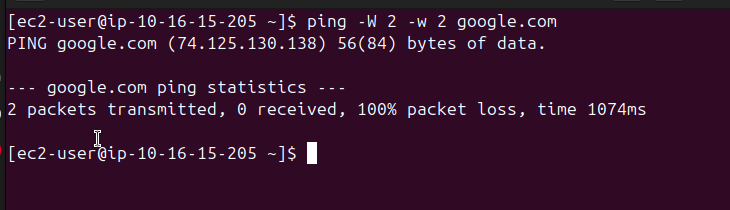

## Create Network Access Control List (NACL)

- Creating NACL for `demo-vpc`

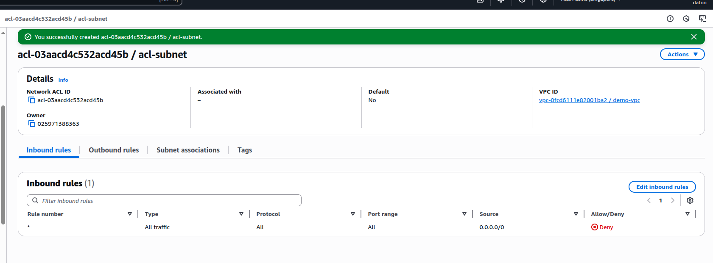

- Associate NACL to subnet `public-subnet-1`

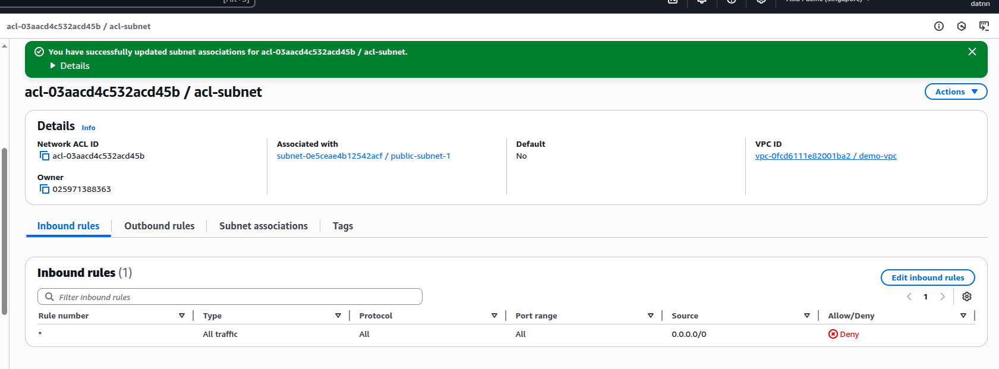

- Now, we will unable to connect to EC2 instance

- Update inbound rule and outbound rule

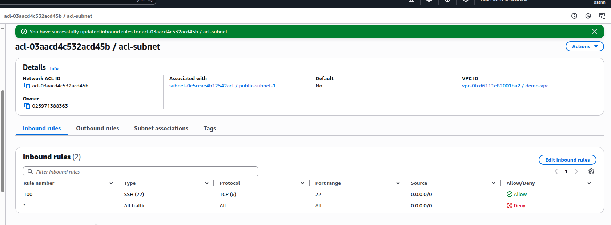
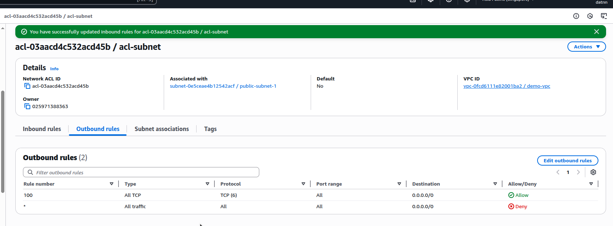
