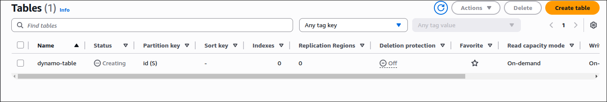
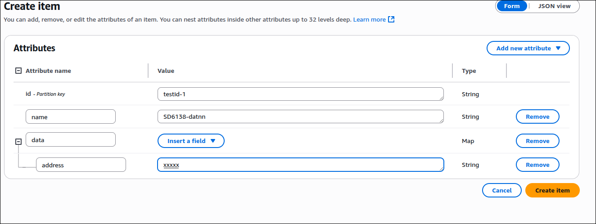

# AWS DynamoDB


## Dynamo console

### Create table




### View table


### Insert record to table




### Update, delete record


*Delete*


### Query table with id = `testid-1`


### Scan table only by name attr


## Working with CLI

### Create table


### Load data

- Create a sample products.json file


- Load with CLI


### Read data


### Modify data


- Check data modified from 1200 quantity to 1300


## Lambda function to dynamodb

### Create lambda function to interact with dynamodb
```python
import json
import boto3
def lambda_handler(event, context):
    dynamodb = boto3.resource('dynamodb',region_name="ap-southeast-1")
    table = dynamodb.Table('dynamo-table')
    response = table.get_item(
        Key={
            "id": "testid-1"
        }
    )
    item = response.get("Item")
    return {
        'statusCode': 200,
        'headers': {
            'Content-Type': 'application/json',
            'Access-Control-Allow-Origin': '*'
        },
        'item': item,
        'body': json.dumps('Hello from Lambda!')
    }

```


### Test lambda function

