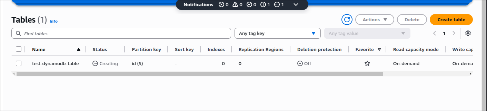
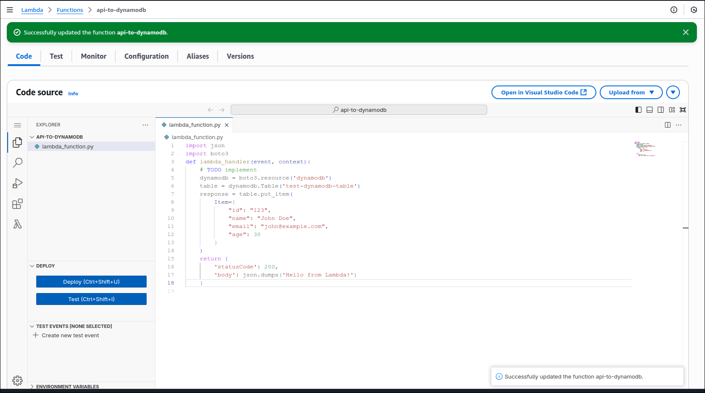
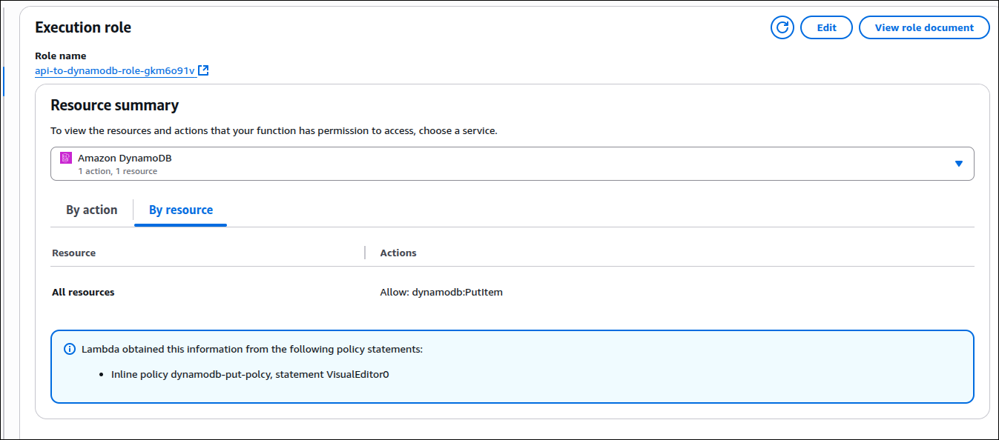
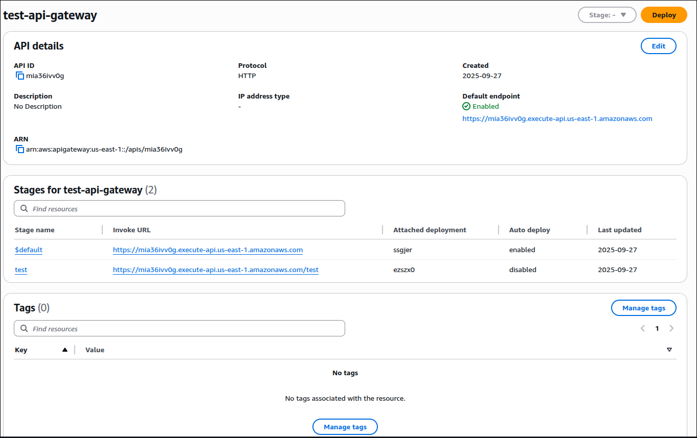
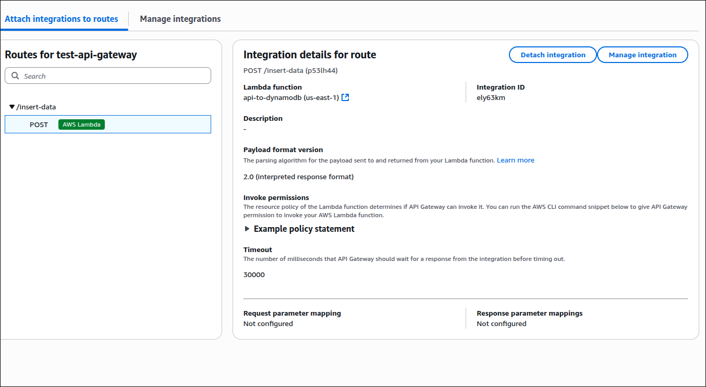
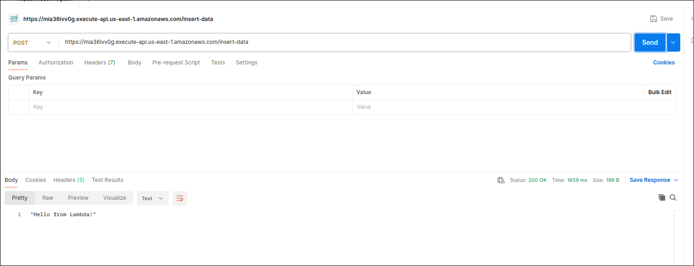
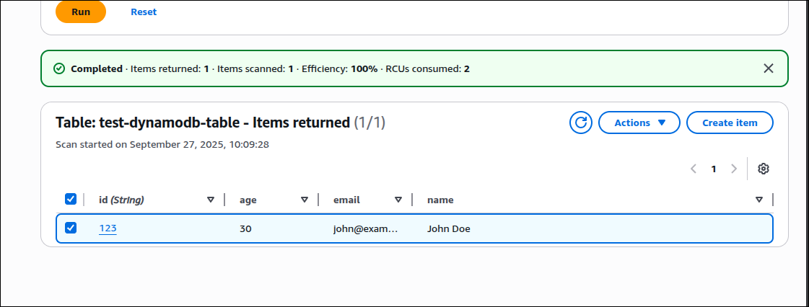

# AWS API Gateway

## Create DynamoDB table

## Create lambda function to store item to DynamoDB

-  Adding permission to write to DynamoDB

## Create API Gateway

## Test with Postman

Found new item in DynamoDB

